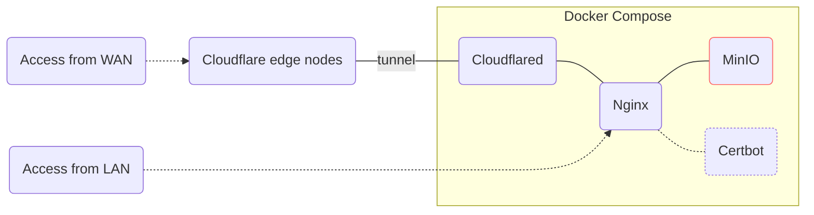

# MinIO Docker Compose

[](https://min.io/)
[](https://github.com/whisperpine/minio-compose/blob/main/LICENSE)
[](https://github.com/whisperpine/minio-compose/actions/workflows/checks.yml)
[](https://github.com/whisperpine/minio-compose/deployments/infra-default)
[](https://github.com/whisperpine/minio-compose/releases)

Deploy [MinIO](https://min.io/) by docker compose.
Get proxied by [Nginx](https://github.com/nginx/nginx),
with TLS certificates auto renewed by [Certbot](https://github.com/certbot/certbot).

If you want to self-host an S3 compatible object storage service in your office
or home lab, and access from anywhere, with zero cloud cost, you come to the
right place. While this repo is opinionated and tailored for my use cases, it
may help you get started as a heuristic reference.



## Get Started

- Setup infrastructure by [Terraform](https://github.com/hashicorp/terraform)
  or [OpenTofu](https://github.com/opentofu/opentofu).
- Config environment variables in `.env` file (referto [example.env](./example.env)).
- Run `docker compose up -d` to spin up services.
- Run `sh helper.sh apply` to apply tls certs for the first time.
- Run `sh helper.sh renew` to check if renewal works.
- Config cron to automatically renew tls certs (see [below](#certbot)).

## Docker Compose

Edit `.env` to configure env vars available in `compose.yaml`.
Duplicate [example.env](./example.env) as `.env` to get started.

Due to historical reasons, the command for docker compose differs.
It can be either `docker compose` (new) or `docker-compose` (old).
Thus specify the command by `DOCKER_COMPOSE` env var in `.env` file.

## Services

### Cloudflare Tunnel

[Cloudflare Tunnel](https://developers.cloudflare.com/cloudflare-one/connections/connect-networks/)
provides a secure way to host without a publicly IP address.
It's recommended to set up infrastructures like Cloudflare Tunnel by [Terraform](https://www.terraform.io/).
See [infra/README.md](./infra/README.md) for more details.

### Nginx

By default, template files in `/etc/nginx/templates/*.template` will be read
and the result of executing `envsubst` will be output to `/etc/nginx/conf.d/`.
Refer to [Using environment variables in nginx configuration (new in 1.19)](https://hub.docker.com/_/nginx#:~:text=Using%20environment%20variables%20in%20nginx%20configuration%20(new%20in%201.19)).

Scripts under `/docker-entrypoint.d` are automatically executed by nginx
container. [dummy-tls.sh](./scripts/dummy-tls.sh) is mounted there for creating
dummy tls certs to prevent nginx crash loop. The dummy tls certs will be
replaced by eligible ones after running `sh helper.sh apply`.

Nginx is also used in conjunction with [certbot](#certbot)
to apply and renew tls certificates.

### Certbot

[apply-tls.sh](./scripts/apply-tls.sh) and [renew-tls.sh](./scripts/renew-tls.sh)
are helper scripts to simplify TLS certs management.
Both of them will source the environment variables defined in `.env` file.

[apply-tls.sh](./scripts/apply-tls.sh) will probably be executed only once
(if everything's ok in [Get Started](#get-started)).

[renew-tls.sh](./scripts/renew-tls.sh) should be executed repeatedly before tls
certs expire (no more than 3 months). To reduce manual work, it's recommended to
config `crontab` in the host OS:

```sh
# run the following command in the root path of this repo.
sudo tee /etc/cron.d/minio-compose << EOF
# renew every 2 months (on the first day of the month).
0 0 1 */2 * root cd $(pwd) && sh helper.sh renew
EOF
```
